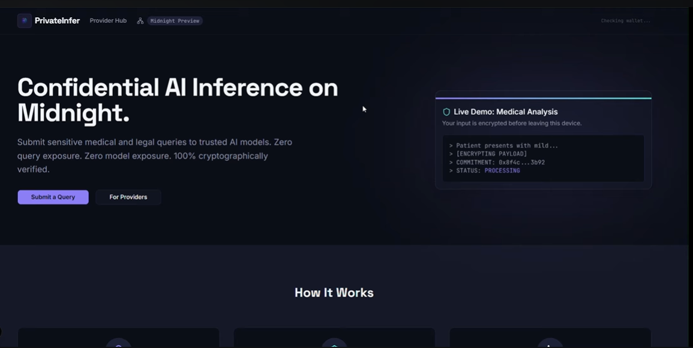
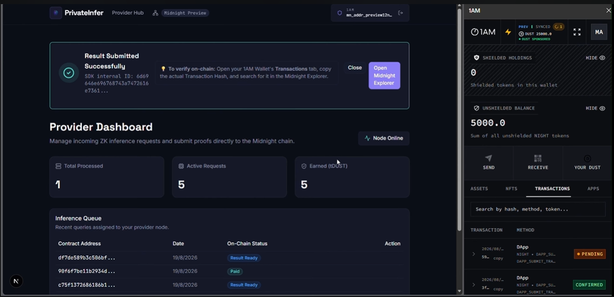
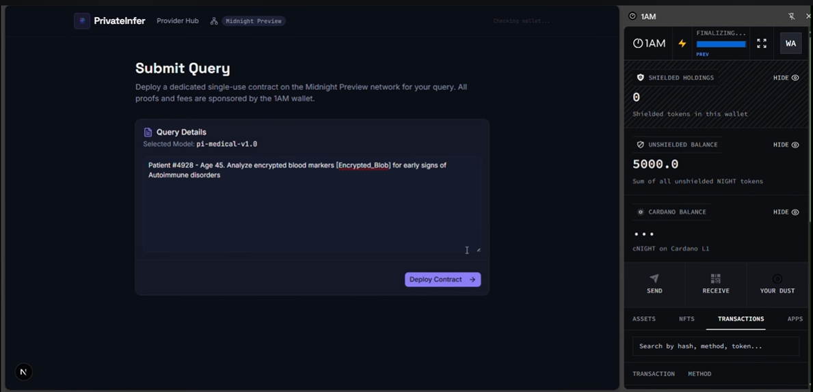
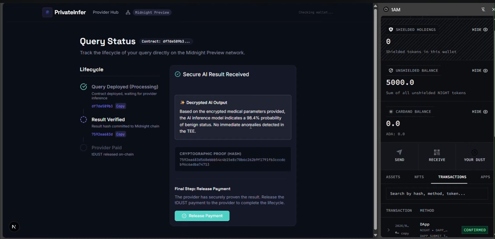
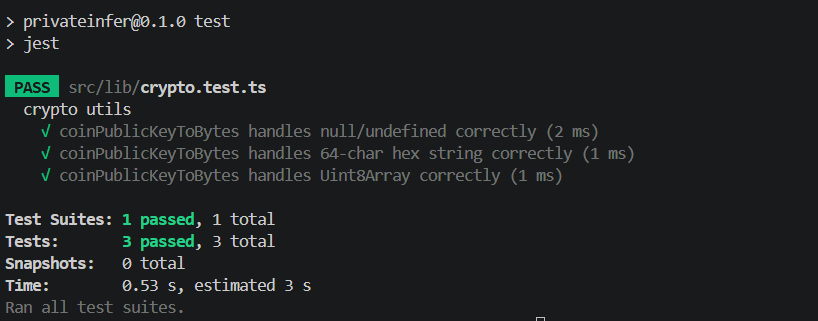



  

  # 🔒 PrivateInfer

  **Secure, Trustless Off-Chain AI Inference Powered by Midnight Network's Zero-Knowledge Proofs.**

  
  
  
  
  

 

  <h3>🌍 <a href="https://private-infer.vercel.app/">Live Deployment</a> | 🎥 <a href="https://youtu.be/w2uHJ5s_E6I">Demo Video</a></h3>

 

## 💡 About the Product Idea

### ❌ The Problem
As AI becomes integral to enterprise operations, industries dealing with highly sensitive data (like Healthcare, Finance, and Legal) face a massive roadblock: **Data Privacy**. 
If a hospital wants to use an advanced AI model to analyze a patient's medical history for early disease detection, they cannot simply send this data to a public LLM like ChatGPT or put it on a public blockchain. Doing so exposes confidential data, violates compliance laws (like HIPAA), and destroys user trust. 

### ✅ The Solution
**PrivateInfer** leverages the Midnight Network to solve this problem by providing a trustless marketplace for secure, off-chain AI inference. 
1. **Encrypted Inputs:** The Query Maker (e.g., a Hospital) submits highly sensitive, encrypted data.
2. **Secure Processing:** A decentralized AI Provider Node picks up the task and processes the data strictly inside a secure "black box" (a Trusted Execution Environment / TEE).
3. **Zero-Knowledge Proofs:** The AI Provider submits the result back to the Midnight smart contract along with a ZK-Proof. This mathematically guarantees to the hospital that the AI model was run exactly as requested—**without ever revealing the patient's data or the result on the public ledger.**
4. **Trustless Escrow:** The smart contract automatically manages the escrow and releases the tDUST payment only when a valid proof is verified on-chain.

---

## 🛡️ Public State vs. Private Witness in PrivateInfer

PrivateInfer's smart contract (contracts/privateinfer.compact) expertly uses Midnight's programming model to separate what the network knows from what the network verifies.

### 🌐 Public State (On-Chain)
The public state only tracks opaque identifiers, cryptographically secure hashes, and escrow balances. 
- **Query Commitment Hash:** The hash of the encrypted input data (preventing tampering).
- **Result Hash:** The hash of the final AI inference output.
- **Statuses:** State machine markers (e.g., Processing, ResultReady, Paid).
- **Escrow:** The locked tDUST reward.

### 🕵️‍♂️ Private Witness (Off-Chain Execution)
The actual sensitive data is handled strictly as private witnesses during local circuit execution.
- **Caller Identity:** We assert disclose(caller) == query.creator inside local circuits to prevent unauthorized users from releasing payments, but the network only validates the proof, never exposing the caller's identity publicly.
- **AI Payload:** The actual prompt and the AI's response remain entirely off-chain. The ZK-proof simply proves that the hash of the local result matches the commitment on-chain.

---

## 📸 Product Screenshots

| Landing Page | Provider Dashboard |
| :---: | :---: |
|  |  |

| Creating a Query | Secure Result Ready |
| :---: | :---: |
|  |  |

---

## 📜 Smart Contracts

Our compact smart contract securely manages the escrow lifecycle, enforces state transitions, and verifies Zero-Knowledge proofs for AI inference. 

**Main Contract Address (Midnight Preview Testnet):** 
[f8aa07189746565ff037f4c0e37e2d4da99424d0aff92a62344325a499533992](https://explorer.preview.midnight.network/contracts/stream/f8aa07189746565ff037f4c0e37e2d4da99424d0aff92a62344325a499533992)

### 🔗 Sample Midnight Network Transactions
* 🟢 **Create Query:** [ab8607371723...](https://explorer.1am.xyz/tx/ab860737172342dd59ac880ac25230579a92e8171c6a7e77dd5f706ff33304fd?network=preview)
* 🟡 **Submit Result & Proof:** [c7dfa24e3f66...](https://explorer.1am.xyz/tx/c7dfa24e3f66a80c7f6cc0dd0fe69cc8502cb8be1fbebfee96afa28d1772331d?network=preview)
* 🔵 **Release Payment:** [8ab94e92e295...](https://explorer.1am.xyz/tx/8ab94e92e2957f9bd1ebe250a27529886178de5a7cd5a2f35a8c03a1c7142155?network=preview)

### Contract Deployment Images
*(Check the ssets/SMART-CONTRACTS/ folder for visual proofs of contract deployment and interaction)*

 

---

## 🏗️ Architecture & Workflow

### Project Architecture
`mermaid
graph TD
    UI[Next.js Client UI] --> |Connects via| Wallet[1AM Wallet]
    UI --> |Polls Metadata| DB[(Neon PostgreSQL DB)]
    Wallet --> |Submits ZK Proofs & Txs| Midnight[Midnight Blockchain]
    Midnight --> |Verifies Proofs| SC[Compact Smart Contract]
    ProviderNode[AI Provider Node TEE] --> |Reads Hash| Midnight
    ProviderNode --> |Pushes Off-chain Data| DB
    ProviderNode --> |Submits Result ZKP| Midnight
`

### User-Side Workflow
`mermaid
sequenceDiagram
    participant U as User (Query Maker)
    participant SC as Midnight Smart Contract
    participant P as AI Provider (TEE)
    
    U->>SC: 1. Deploy Query (Lock tDUST, Commit Hash)
    SC-->>P: 2. Network Emits Event
    P->>P: 3. Decrypt & Run AI Inference inside TEE
    P->>SC: 4. Submit ZK Proof & Result Hash
    SC->>SC: 5. Verify Proof (State -> RESULT_READY)
    U->>SC: 6. Verify Result & Release Payment
    SC-->>P: 7. Transfer tDUST Escrow to Provider
`

---

## 📂 File Structure

`	ext
PrivateInfer/
├── contracts/               # Midnight Compact Smart Contracts
│   ├── privateinfer.compact # Core logic for ZK verification & Escrow
│   └── managed/             # Compiled TS/WASM outputs from Compact compiler
├── prisma/                  # Database Schema & Migrations
│   └── schema.prisma        # Postgres models (Query, Provider, Result)
├── src/
│   ├── app/                 # Next.js App Router (Frontend + API Routes)
│   │   ├── query/           # Query Maker UI flows (Create, Status tracking)
│   │   ├── provider/        # AI Provider Dashboard UI
│   │   └── api/             # Backend API for syncing off-chain metadata
│   ├── components/          # Reusable UI components (shadcn/ui)
│   ├── contexts/            # React Contexts (Wallet connection state)
│   └── lib/                 # Utility functions (crypto, DB client)
├── scripts/                 # Admin scripts (e.g., deploying the contract)
└── .github/workflows/       # CI/CD pipelines (Lint, Typecheck, Smart Contract Build)
`

---

## 🧪 Testing

The project uses **Jest** for robust unit testing of our core cryptographic and parsing logic. We've ensured that sensitive operations (like parsing 1AM Wallet public keys into Uint8Array byte buffers for the ZK circuits) are 100% reliable and edge-case secure.

**To run the test suite locally:**
`ash
npm install
npm test
`

---

## 🚀 Future Implementations & Real-World Application

### Real-World Applications
1. **Medical AI:** Hospitals can use PrivateInfer to get AI-driven diagnoses on highly sensitive patient records without violating HIPAA. The ZK-proof guarantees the AI didn't hallucinate the result, and the privacy guarantees the data wasn't leaked.
2. **Proprietary Financial Modeling:** Hedge funds can run complex algorithmic trading models securely on decentralized computing networks without exposing their alpha-generating strategies.
3. **Enterprise Intellectual Property:** Law firms and tech giants can summarize confidential contracts or source code without handing their IP over to centralized cloud providers.

### Future Enhancements
* **Dynamic ZK-VM Integration:** Integrating a complete Zero-Knowledge Virtual Machine so the provider can prove the *entirety* of an LLM execution trace.
* **Reputation System:** Implementing an on-chain staking and slashing mechanism for providers who consistently fail to submit results within a given timeframe.
* **Multiparty Computation (MPC):** Splitting the AI inference across multiple nodes for even higher security guarantees.

---

## 🙏 Salutation

**A massive thank you to the Midnight Network team!** 
The ability to seamlessly blend public state verification with private local execution using compact is game-changing. This platform allowed us to build an enterprise-grade privacy product that would be completely impossible on traditional blockchains. Thank you for building the future of data protection! 💜
