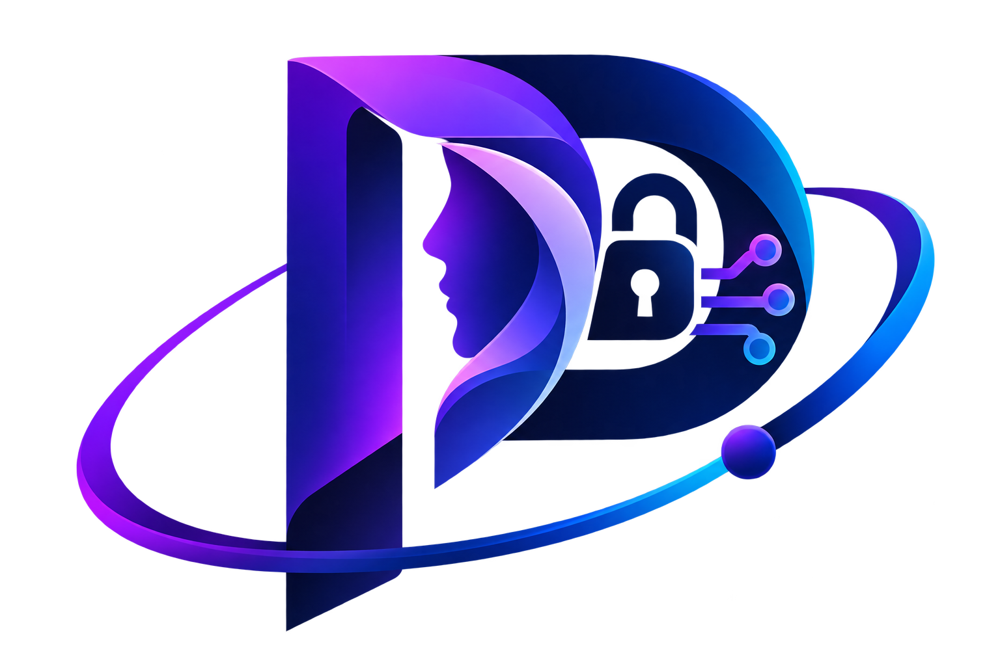
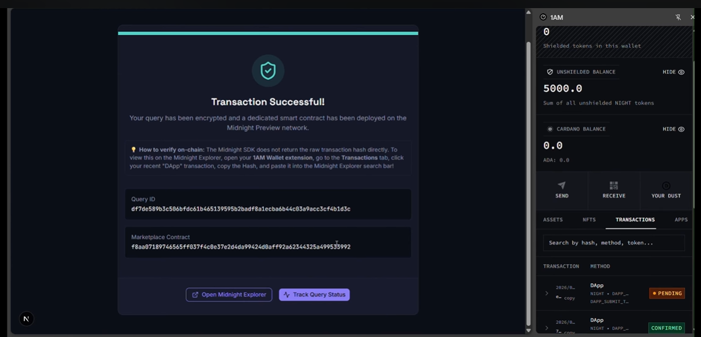
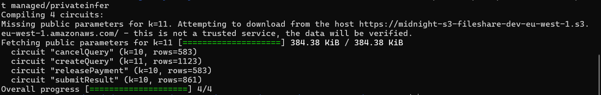
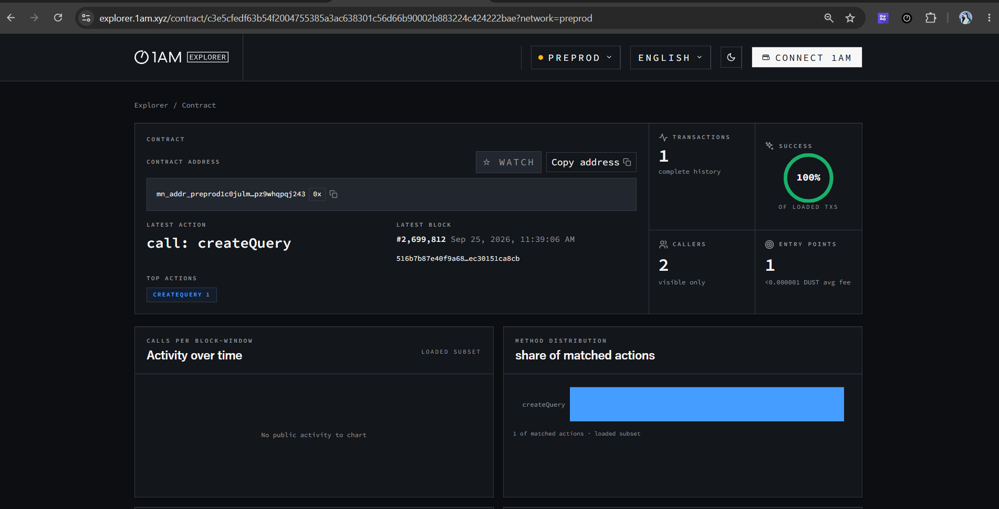
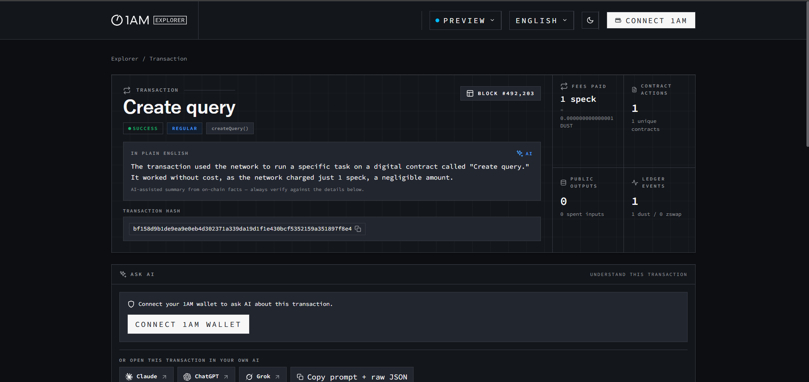
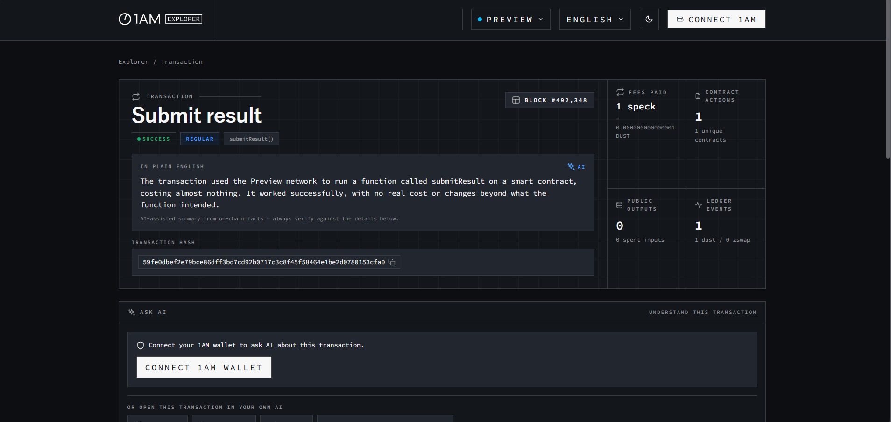
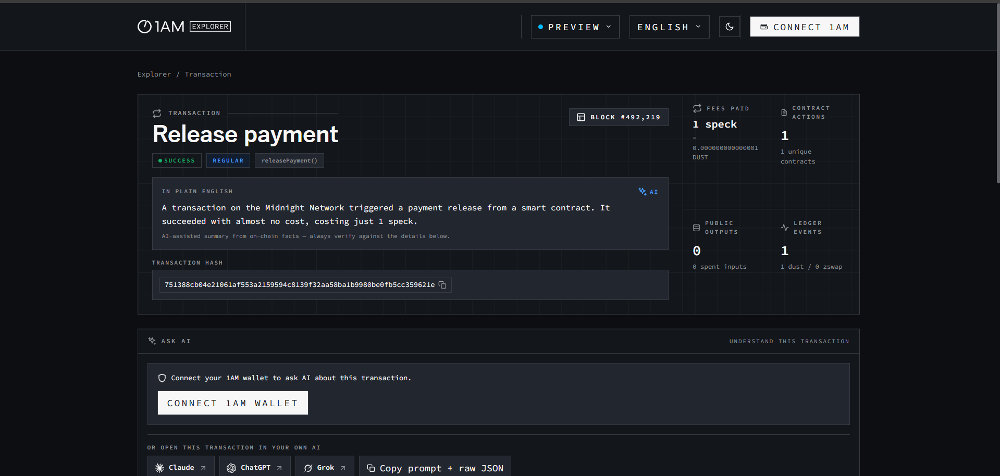
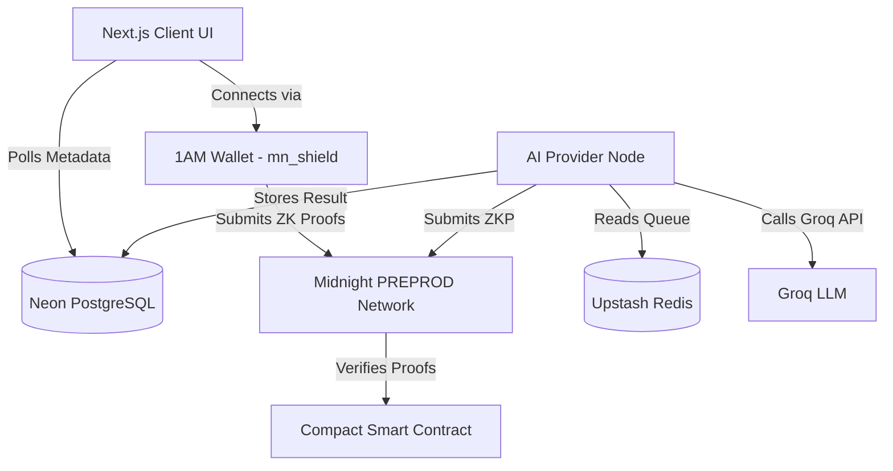
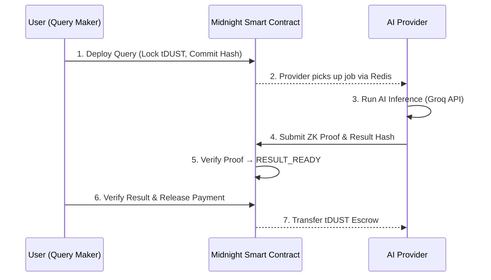

<div align="center">
  

  # 🔒 PrivateInfer

  **Confidential AI Inference Marketplace — Powered by Midnight Blockchain's Zero-Knowledge Proofs.**

  [](https://nextjs.org/)
  [](https://www.typescriptlang.org/)
  [](https://midnight.network/)
  [](https://www.prisma.io/)
  [](https://tailwindcss.com/)
  <br/>
  [](https://github.com/debansh001/PrivateInfer/actions/workflows/frontend.yml)
  [](https://github.com/debansh001/PrivateInfer/actions/workflows/contracts.yml)
  [](https://github.com/debansh001/PrivateInfer/actions/workflows/typecheck.yml)
</div>

<br />

> [!IMPORTANT]
> **Network Notice:** This application and its smart contracts are deployed on the **Midnight PREPROD Network**. Connect with the **1AM Wallet** (`mn_shield` browser extension) set to the `preprod` network. Lace Wallet is not currently supported.

### 🔗 Important Links

- **Live Demo**: [https://private-infer.vercel.app/](https://private-infer.vercel.app/)
- **Product Pitch Deck**: [PrivateInfer Product Pitch](https://docs.google.com/presentation/d/1mBxabZTKyCVx-Ypih9RdAD63pP5EFaDJ/edit?usp=sharing&ouid=117555019266338524733&rtpof=true&sd=true)
- **Product X (Twitter)**: [https://x.com/private_infer](https://x.com/private_infer)
- **Demo Video**: [https://youtu.be/w2uHJ5s_E6I](https://youtu.be/w2uHJ5s_E6I)

### 📚 Documentation

| Document | Description |
|---|---|
| [SETUP.md](SETUP.md) | Local development setup guide |
| [USAGE.md](USAGE.md) | Application usage instructions |
| [PROPOSAL.md](PROPOSAL.md) | PrivateInfer architecture proposal |
| [docs/ARCHITECTURE.md](docs/ARCHITECTURE.md) | **Full system architecture** — contracts, API, DB schema, ZK flows |
| [docs/USERS.md](docs/USERS.md) | Verified beta tester directory (70 participants) |
| [FEEDBACK.md](FEEDBACK.md) | Beta tester raw feedback + implemented changes |

<br />

## 💡 About the Product

### ❌ The Problem
Industries dealing with sensitive data (Healthcare, Finance, Legal) cannot safely send it to public AI models. Doing so exposes confidential data, violates compliance laws (HIPAA), and destroys user trust.

### ✅ The Solution
**PrivateInfer** provides a trustless marketplace for secure, off-chain AI inference on the Midnight blockchain:

1. **Encrypted Inputs:** The Query Maker submits sensitive, encrypted data — only a commitment hash ever touches the chain.
2. **Secure Processing:** A decentralized AI Provider Node processes the data off-chain via Groq-powered inference inside a secure environment.
3. **Zero-Knowledge Proofs:** The Provider submits a ZK-proof to the Midnight smart contract, mathematically guaranteeing the AI ran correctly — **without revealing the data or result on the public ledger.**
4. **Trustless Escrow:** The smart contract automatically releases tDUST payment only after the proof is verified on-chain.

---

## 🛡️ Privacy Model — Public vs. Private

| | Public State (On-Chain) | Private Witness (Off-Chain) |
|---|---|---|
| **Query** | SHA-256 commitment hash only | Actual query text — never leaves client |
| **Result** | SHA-256 proof hash only | Decrypted AI response — stored in encrypted DB |
| **Identity** | Opaque public key bytes | Caller identity verified via ZK `disclose()` — not exposed |
| **Escrow** | tDUST balance visible | Transfer amount derived from on-chain state |

---

## 🆕 Recent Updates (September 2026)

### UI / UX Overhaul
- **Full Product Landing Page** — Hero section, animated terminal widget, stats bar (70+ Beta Testers, 100% ZK Verified), How It Works (3-step flow), 6-card features grid, Provider CTA section, FAQ accordion, and a complete footer with nav links and copyright. *Commit [`94c8b69`](https://github.com/debansh001/PrivateInfer/commit/94c8b694a58cc98297fcdae101683ded63dbdfa4)*
- **Admin Ops Dashboard** — Replaced the single deploy button with a full 4-tab monitoring dashboard: Live Stats, Queries table (color-coded status badges), Providers table, and a Contract Deploy tab with Midnight SDK. *Commit [`94c8b69`](https://github.com/debansh001/PrivateInfer/commit/94c8b694a58cc98297fcdae101683ded63dbdfa4)*
- **Real Wallet Connect Button** — Header "Connect Wallet" now directly calls the wallet SDK (was previously just a navigation link). Shows connected address with live green pulse dot + disconnect button. *Commit [`54acd1b`](https://github.com/debansh001/PrivateInfer/commit/54acd1b106a5880645914c3de9d39fefcf0540b8)*
- **Theme Toggle Fixed** — Light/dark mode now works correctly. Split CSS into proper `:root` (light) and `html.dark` (dark) blocks; fixed Tailwind v4 `@custom-variant dark` selector for `next-themes` compatibility. *Commit [`94c8b69`](https://github.com/debansh001/PrivateInfer/commit/94c8b694a58cc98297fcdae101683ded63dbdfa4)*
- **Logo Displayed** — `public/logo.png` now shown in both the header and footer (was previously a generic icon). 

### Beta Tester Feedback Fixes
- **Copy Button** — Added one-click copy to the decrypted AI result output on `/query/[id]`. *Commit [`54acd1b`](https://github.com/debansh001/PrivateInfer/commit/54acd1b106a5880645914c3de9d39fefcf0540b8)*
- **Processing Spinner** — Query submission page now shows an animated spinner and "Please do not refresh" message during ZK proof generation. *Commit [`89416df`](https://github.com/debansh001/PrivateInfer/commit/89416df85d7ecff4b92ba4038c9da64f9bcf0537)*
- **Explorer Warning Banner** — The 1AM Explorer hint is now a prominent red `🚨 ATTENTION` banner so users don't miss it. *Commit [`89416df`](https://github.com/debansh001/PrivateInfer/commit/89416df85d7ecff4b92ba4038c9da64f9bcf0537)*
- **Non-1AM Wallet Toast** — When Lace Wallet or wrong network is detected, a toast notification now explains PREPROD-only support. *Commit [`54acd1b`](https://github.com/debansh001/PrivateInfer/commit/54acd1b106a5880645914c3de9d39fefcf0540b8)*

---

## 📸 Product Screenshots

| 1. Landing Page | 2. Creating a Secure Query |
| :---: | :---: |
|  |  |

| 3. Query Deployed Successfully | 4. AI Provider Dashboard |
| :---: | :---: |
|  |  |

| 5. Secure AI Result & Payment Release |
| :---: |
|  |

---

## 📜 Smart Contracts

Our Compact smart contract manages escrow lifecycle, enforces state transitions, and verifies ZK proofs for AI inference.

**Deployed Contract Address (Midnight PREPROD):**
```
c3e5cfedf63b54f2004755385a3ac638301c56d66b90002b883224c424222bae
```
[View on 1AM Explorer ↗](https://explorer.1am.xyz/contract/c3e5cfedf63b54f2004755385a3ac638301c56d66b90002b883224c424222bae?network=preprod)

### 🔗 Sample PREPROD Transactions

| Circuit | Transaction |
|---|---|
| 🟢 **Create Query** | [`516b7b87...`](https://explorer.1am.xyz/tx/516b7b87e40f9a684aec47ab31eb57f655d232495539e2ea3a79ec30151ca8cb?network=preprod) |
| 🟡 **Submit Result & Proof** | [`c7dfa24e...`](https://explorer.1am.xyz/tx/c7dfa24e3f66a80c7f6cc0dd0fe69cc8502cb8be1fbebfee96afa28d1772331d?network=preprod) |
| 🔵 **Release Payment** | [`8ab94e92...`](https://explorer.1am.xyz/tx/8ab94e92e2957f9bd1ebe250a27529886178de5a7cd5a2f35a8c03a1c7142155?network=preprod) |

### Contract Deployment Visuals

#### 1. Contract Circuits
<br/><br/>

#### 2. Successful Deployment
<br/><br/>

#### 3. ZK Proof: Create Query
<br/><br/>

#### 4. ZK Proof: Submit Result
<br/><br/>

#### 5. ZK Proof: Release Payment


---

## 🏗️ Architecture

For the full technical architecture, see **[docs/ARCHITECTURE.md](docs/ARCHITECTURE.md)**.

### High-Level Diagram



### User Workflow



---

## 📂 File Structure

```text
PrivateInfer/
├── contracts/                  # Midnight Compact Smart Contracts
│   ├── privateinfer.compact    # Core ZK verification & escrow logic
│   └── managed/                # Compiled TS/WASM outputs
├── docs/                       # Documentation
│   ├── ARCHITECTURE.md         # Full system architecture
│   └── USERS.md                # Verified beta testers directory (70 wallets)
├── prisma/                     # Database
│   └── schema.prisma           # PostgreSQL models (Query, Provider, Result)
├── scripts/
│   └── worker.ts               # Off-chain AI inference worker (Groq)
├── src/
│   ├── app/
│   │   ├── page.tsx            # Landing page (hero, FAQ, footer)
│   │   ├── admin/page.tsx      # Admin ops dashboard (4 tabs)
│   │   ├── history/page.tsx    # Query history for connected wallet ← NEW
│   │   ├── query/new/          # Query submission UI
│   │   ├── query/[id]/         # Query status + ZK result UI
│   │   ├── provider/           # AI Provider dashboard
│   │   └── api/                # REST API routes
│   ├── components/
│   │   └── Header.tsx          # Sticky header with wallet connect + nav
│   ├── contexts/
│   │   └── WalletContext.tsx   # Wallet state management
│   └── lib/                    # Shared utilities (DB, Redis, crypto)
├── public/
│   ├── logo.png                # PrivateInfer logo
│   └── zk/privateinfer/        # Compiled ZK proving/verifying keys
├── FEEDBACK.md                 # Beta tester feedback + implemented changelog
├── SETUP.md                    # Local development setup
└── .github/workflows/          # CI/CD (Typecheck, Frontend, Contracts)
```

---

## 🧪 Testing

Jest unit tests cover core cryptographic logic — including the `coinPublicKeyToBytes` conversion that transforms 1AM Wallet public keys into `Uint8Array` buffers for use in ZK circuits.

```bash
npm install
npm test
```

```bash
# TypeScript check
npm run typecheck

# Production build
npm run build
```


---

## 📝 User Feedback & Beta Testing

**70 verified beta testers** participated across the Midnight PREPROD testing phase (September 12–22, 2026), recruited via Discord and Telegram. All testers used the **1AM Wallet** on the **Midnight PREPROD network**. Each wallet address is verifiable on the [1AM Explorer](https://explorer.1am.xyz/?network=preprod).

| Resource | Description | Link |
|---|---|---|
| **Feedback Form** | Google Form used to collect structured tester feedback during the beta | [forms.gle/nYS9vPbCfWTQgKk56](https://forms.gle/nYS9vPbCfWTQgKk56) |
| **Response Sheet** | All 70 raw form responses with ratings, comments, timestamps, and wallet addresses | [Google Sheets ↗](https://docs.google.com/spreadsheets/d/1gRTG3rp0X3FshsP7X_0es1nJLm_Wq1l7s2-H4UdWr5k/edit?usp=sharing) |
| **Verified Testers** | Full directory of 70 testers — name, PREPROD wallet address, and 1AM Explorer verification link for each | [docs/USERS.md](docs/USERS.md) |
| **Feedback Changelog** | Raw tester feedback with real wallet addresses + every implemented change linked to its git commit ID | [FEEDBACK.md](FEEDBACK.md) |

### Changes Shipped Directly from Beta Feedback

| Feedback | From | Commit |
|---|---|---|
| Added copy button to AI result output | Manash Koley | [`e3a4a9c`](https://github.com/debansh001/PrivateInfer/commit/e3a4a9c) |
| Processing spinner + "do not refresh" message | Rubina Mondal | [`e3a4a9c`](https://github.com/debansh001/PrivateInfer/commit/e3a4a9c) |
| Explorer hint redesigned as red `🚨 ATTENTION` banner | Faisal Islam | [`e3a4a9c`](https://github.com/debansh001/PrivateInfer/commit/e3a4a9c) |
| Light/dark theme toggle fully fixed | Habibullah Mir | [`94c8b69`](https://github.com/debansh001/PrivateInfer/commit/94c8b69) |
| Connect Wallet button actually connects (was just a link) | Multiple testers | [`54acd1b`](https://github.com/debansh001/PrivateInfer/commit/54acd1b) |
| Lace Wallet error toast with PREPROD-only guidance | Priya Das | [`54acd1b`](https://github.com/debansh001/PrivateInfer/commit/54acd1b) |
| **Query history page `/history`** | Fatima Khatun | [`659cc93`](https://github.com/debansh001/PrivateInfer/commit/659cc93) |

---

## 🚀 Future Roadmap

| Feature | Status |
|---|---|
| Query history page (`/history`) | ✅ Shipped |
| Auto-submit script for provider nodes | ⏳ Planned |
| AI model selection dropdown (Medical / Legal / General) | ⏳ Planned |
| Lace Wallet full support | ⏳ Planned |
| On-chain provider reputation / staking | 🔭 Research |
| Dynamic ZK-VM for full LLM execution trace | 🔭 Research |
| Multiparty Computation (MPC) inference | 🔭 Research |

---

## 🙏 Salutation

**A massive thank you to the Midnight Network team!**
The ability to seamlessly blend public state verification with private local execution using Compact is game-changing. This platform allowed us to build an enterprise-grade privacy product that would be completely impossible on traditional blockchains. Thank you for building the future of data protection! 💜
